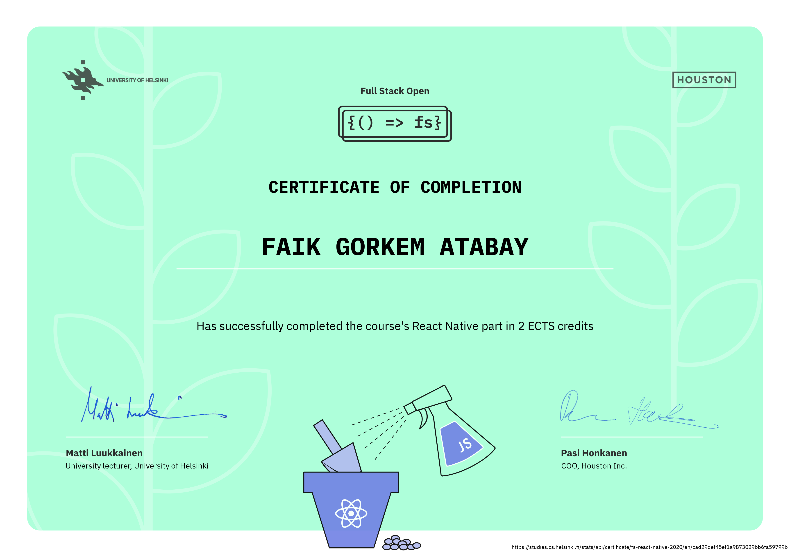

# Github Repository Rating App

This app uses the GraphQL API from [https://github.com/fullstack-hy2020/rate-repository-api](https://github.com/fullstack-hy2020/rate-repository-api), so make sure the server is running before starting the application.

Install the dependencies.

```sh
cd rate-repository-app
npm install
npm start
```

- Then follow instructions in the console.

> ## University of Helsinki Certificate


Certificate link: https://studies.cs.helsinki.fi/stats/api/certificate/fs-react-native-2020/en/cad29def45ef1a9873029bb6fa59799b
